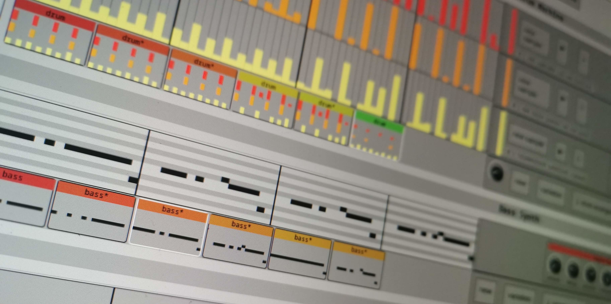

# WAIVE - Online

Prototype browser-based interface to WAIVE: the AI that generates dance music from archived sound materials.

In development environment:
```
$ npm install
$ npm run build
```
and
```
$ flask --app server.py run
```

### OSC Bridge
To install OSC message bridge, run:
```
$ npm init
$ npm install osc-js
```
and save `osc_bridge.js` in the directory.

To run OSC message bridge, use:
```
$ node osc_bridge.js [host [port]]
```
where you can optionally specify a host ip, or host and port. Default host and port `localhost 9129`.

Now, Max/MSP, PureData etc can listen for OSC messages on the specified port. The address space is as follows:
```
/audio
  /bpm          : int        beats per minute
  /transport    : int int    bar:beat
  /playing      : bool       playing state
  /drum
    /kd         : float      kick drum velocity
    /sd         : float      snare drum velocity
    /hh         : float      high hat velocity
  /bass         : int        bass MIDI note
  /sound        : string     sample name
```
e.g.
- `/audio/transport 1 2` means third beat of the second bar (beats and bars are zero indexed).
- `/audio/drum/sd 0.75` means a snare drum has just been triggered with a velocity (strength) of 0.75.
Velocity values are in the range 0-1.
